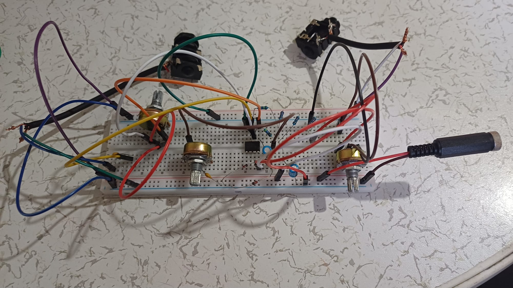

# Analog Audio Projects & Prototyping

This repository documents the design, prototyping, and assembly of custom analog audio equipment. 
The projects focus on signal path analysis, component selection, and noise reduction techniques.

---

## Project 1: High-Gain Distortion Pedal (TL072 Based)

**Current Status:**  *Phase 2: Breadboard Testing & Verification*

### 1. Circuit Schematic (Design Phase)
Hand-drawn technical schematic illustrating the signal flow, gain stages, and power filtration.

### 2. Breadboard Prototype (Testing Phase)
The circuit is currently built on a breadboard to verify the clipping diode symmetry and frequency response before final soldering.

---

*Repository is actively updated as the prototyping phase progresses to the final product.*
